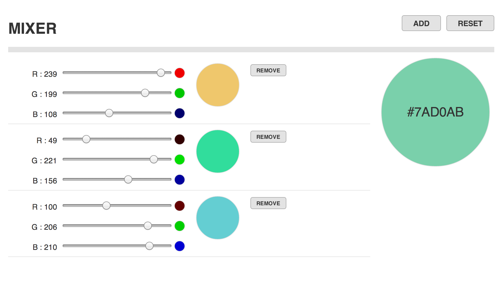

#Flux & React Kata { Colour Mix }

##Run
Install dependecies:
    
    npm install

Run simple server:
    
    ./server

Visit:

    http://localhost:4567

##Development
Watch & compile 
        
    npm start

##Production
   
   grunt js-compress

